# iObserve EBR — Electronic Batch Records

**Система мониторинга производства косметических кремов.**

Цифровой журнал производственных записей, устраняющий человеческий фактор при документировании технологических процессов. Каждое измерение — взвешивание ингредиента, температура реактора, время операции — фиксируется автоматически, верифицируется относительно рецептуры и сохраняется с полным аудит-треком.

---

## Цель проекта

> Повысить **прослеживаемость** и **достоверность** данных за счет разработки информационно-аналитической системы документирования класса **EBR (Electronic Batch Record)**

**Прослеживаемость (traceability)** — свойство системы документирования, обеспечивающее возможность восстановить полную картину технологического процесса.

**Достоверность** — свойство данных не иметь скрытых или случайных ошибок (ГОСТ Р 55170-98)

## Соответствие стандартам

- ТР ТС 009/2011 — обязательный регламент с требованием к детальному документированию во время производства
- ГОСТ ISO 22716 (GMP для косметики) — методическая база для выполнения требований ТР ТС 009/2011
- FDA Guidance on Data Integrity (2018) — принципы ALCOA+ для целостности данных
- 21 CFR Part 11 — требования к электронным записям и контролю аудита (audit trail)


## Реализовано

- Авторизация через JWT-токен, разграничение доступа по ролям (`operator`, `admin`)
- Приём телеметрии от симулятора ПЛК через MQTT-брокер (Mosquitto)
- Валидация параметров: сравнение фактических значений с рецептурой, генерация алертов при отклонениях
- Аудит через триггерную функцию в PostgreSQL — каждое изменение строки фиксируется автоматически
- Триггер на вставку уникальных кодов, рецептур, партий, логинов
- Автоматическая сборка итогового протокола партии по завершении процесса
- HTTP-сервер на `net/http` с REST API: управление рецептурами, история партий, экспорт отчётов, управление пользователями
- WebSocket-эндпоинт для передачи телеметрии в реальном времени
- Пользовательские интерфейсы оператора и администратора (HTML / CSS / JS, без фреймворков)

**Практическая направленность:** реализован типовой сценарий промышленного IoT-мониторинга — асинхронный сбор данных с источников, их обработка и сохранение для анализа. Архитектурно это соответствует паттернам работы с потоковыми данными и демонстрирует переход от бумажного учёта к автоматизированному.

---

## Стек

| Компонент | Технология |
|-----------|-----------|
| Язык | **Go 1.25**, стандартная библиотека `net/http` |
| База данных | PostgreSQL 18 |
| Миграции | golang-migrate v4 |
| Аутентификация | JWT — `golang-jwt/jwt/v5` |
| Логирование | Uber Zap |
| MQTT | Eclipse Mosquitto 2.0 — телеметрия оборудования |
| Контейнеризация | Docker, Docker Compose |
| API | REST + WebSocket, JSON |
| Фронтенд | Vanilla HTML / CSS / JS — static files |
| Сборка, запуск, окружение | Makefile | 
---
## Обоснование выбора технологий

Выбор технологий продиктован целью — обеспечением **достоверности данных** (свойство данных не иметь скрытых ошибок, ГОСТ Р 55170-98). Каждая технология закрывает конкретный класс ошибок.

### Ошибки системы

| Технология | Класс ошибок, который устраняет |
|------------|--------------------------------|
| **PostgreSQL** | Ошибки целостности данных (транзакционная целостность ACID) |
| **Триггеры PostgreSQL** | Аномалии конкурентного доступа (race condition) |
| **Docker** | Ошибки развёртывания, невоспроивзодимость системы на этапах разработки, тестирования и эксплуатации |
| **MQTT с QoS 1** | Потеря сообщений при передаче телеметрии |

### Ошибки ручного документирования

| Механизм системы | Класс ошибок, который устраняет |
|------------------|--------------------------------|
| Автоматизированный сбор телеметрии через MQTT | Неполнота данных (исключает ручной ввод) |
| Контроль workflow (последовательность стадий) | Пропуск этапов или нарушение порядка |
| Модуль контроля отклонений | Кратковременные аномалии датчиков, устойчивые отклонения от рецептуры |

## Достижение цели

### Достоверность данных повышена за счет снижения частоты ошибок

| **До** | 
|-----------|
| Частота ошибок ручного ввода 4-5% (Источник: FDA): 
- оператор неправильно переписал показатель, округлил: 1-2% 
- оператор пропустил запись: 1-2%
- неразборчивая запись: 0.5-1%
- ошибки расчетов: 0.5% 


| **После** |
|-----------|
| Частота технических ошибок < ~0.04%
- Сбой работы датчика: потеря связи = 0.025% (Источник: расчеты ниже)
- Сбой работы брокера сообщений: потери данных нет, данные в буфере. 
при QoS 1 потери < 0.01% (спецификация протокола)
- Сбой работы PostgreSQL: потери данных нет. Вероятность сбоя локального железа: 0.003% (3 часа (средняя смена) / 100000 часов (MTBF))

Расчеты:

p(вероятность сбоя одного датчика за смену) = t_смены / **MTBF (Mean Time Between Failures)**
P(вероятность сбоя хотя бы одного датчика за смену) = 1 - (1-p₁)^m × (1-p₂)^k × ... × (1-pₙ)^l

Смена оператора: 3 часа.

| Тип параметра | Кол-во | MTBF (часы) | p (3 часа)
|-----------|-----------|-----------|-----------|
| Температура | 3 шт. | 200000 | 0.000015 | 
| Скорость мешалки | 3 шт. | 100000 | 0.00003 |
| Тензодатчик | 3 шт. | 150000 | 0.00002 |
| Давление | 1 шт. | 150000 | 0.0002 |
| Скорость гомогенизатора | 1 шт. | 100000 | 0.00003 |

P(Сбой хотя бы одного датчика) = 0.025%

**Итог:**
- Частота ошибок снижена в 100 раз;
- Достоверность данных повышена с 95% (FDA) до 99.96% (расчет MTBF).

### Прослеживаемость данных повышена за счет полноты данных и автоматической агрегации
| **До (бумага)** | **После (ИАС)** |
|-------------------------|-----------------|
| ~200 записей за цикл (точечные снимки) | 23 760 точек данных (11 датчиков × каждые 5 сек × 3 часа + другие записи в отчете) |
| "Слепые зоны" между записями оператора | Непрерывная фиксация — любое отклонение регистрируется |
| Ручное сопоставление бумажного протокола с SCADA | Автоматическая связь: партия → этап → параметр → оператор |
| Поиск причины брака: ~3 часа | Поиск причины брака: ~1 час |

**Итог:**

- Полнота данных повышена в 118 раз
- Скорость поиска причины брака ускорена в 3 раза
- Система гарантирует прослеживаемость по определению: фиксация данных автоматическая, ручной ввод исключён

## Архитектура

### C4 Level 1 — System Context

> Кто пользуется системой и с какими внешними системами она взаимодействует.


---

### C4 Level 2 — Containers

> Из каких контейнеров состоит система и как они общаются.


---

### C4 Level 3 — Components

> Внутреннее устройство Go-сервиса: хендлеры, сервисы, репозитории.


---

### Sequence — Регистрация партии

> Полный путь запроса `POST /api/v1/batches` через все слои.


---

### Sequence — Приём MQTT-телеметрии

> Как данные с оборудования попадают в систему и генерируют алерты.


---

### Жизненный цикл партии

> Все статусы партии от регистрации до завершения или отклонения.


---

## Проектирование

Границы автоматизации (IDEF0: Декомпозиция контекстного уровня):
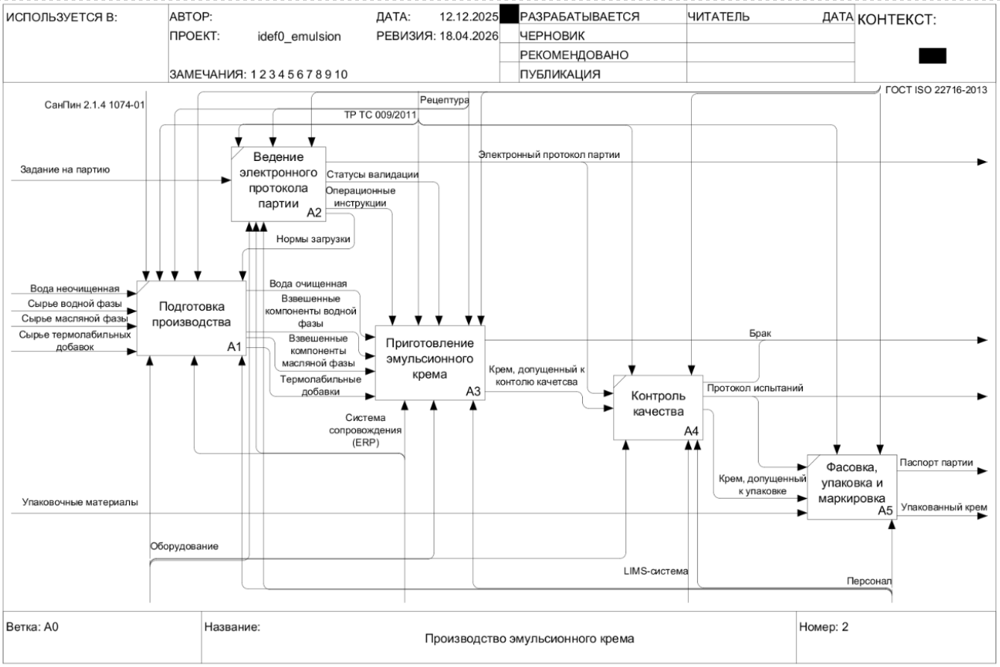
Формализованное описание технологического процесса (IDEF0: Декомпозиция функционального блока А3):
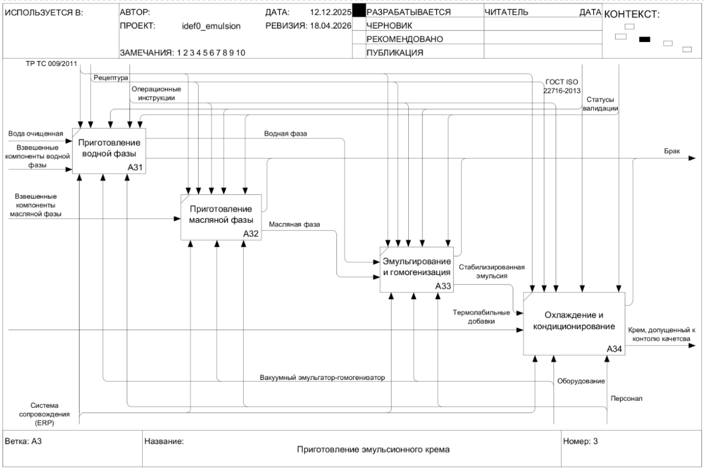
Потоки данных (DFD: Декомпозиция контекстного уровня):
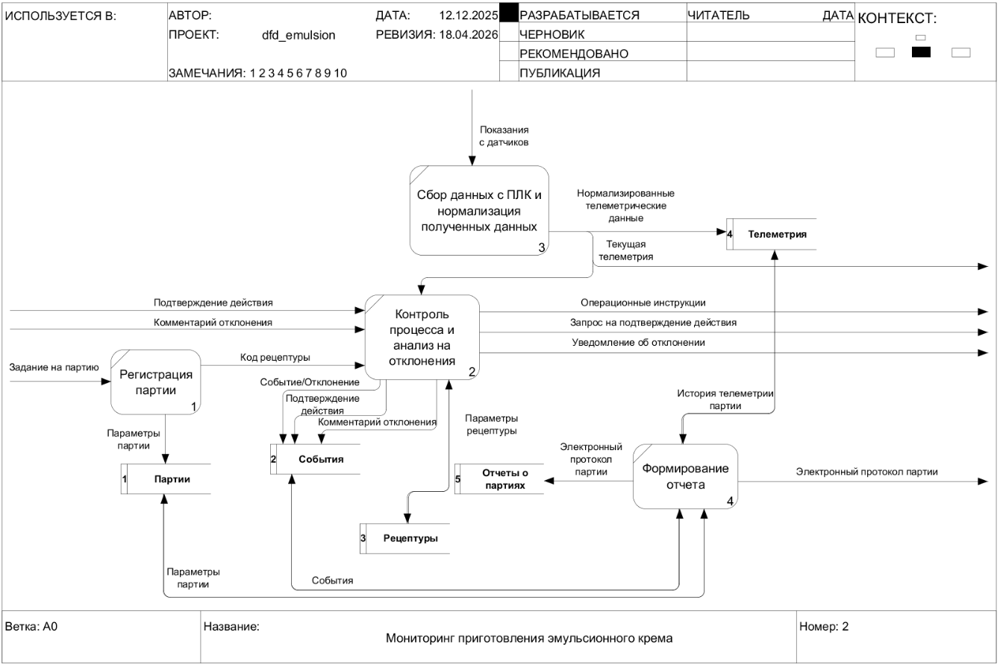
Трехслойная архитектура (ArchiMate):
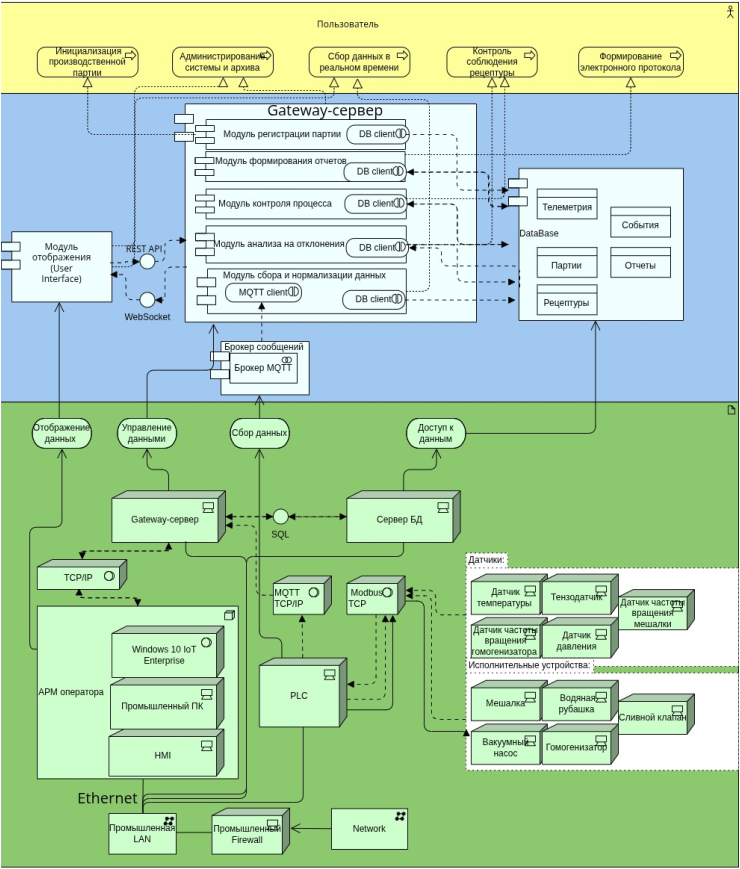


## Скриншоты

### 1. Вход в систему
`POST /api/v1/auth/login` — проверка логина/пароля, выдача JWT с ролью


---

### 2. Панель оператора — дашборд
Агрегация активных партий, журнал событий, быстрые действия


---

### 3. Навигация — раздел «Партии»
Роутинг на клиенте, JWT передаётся в каждом запросе


---

### 4. Список партий
`GET /api/v1/batches` — фильтрация по статусу, пагинация


---

### 5. Регистрация партии — пустая форма
Ожидание ввода кода рецептуры


---

### 6. Подготовка производства (регистрация и взвешивание)
 - `GET /api/v1/recipes/{code}` — frontend получает название, версию, описание, тип оборудования.  
- `min_volume_l` / `max_volume_l` сохраняются локально для валидации объёма до отправки формы.
- `POST /api/v1/batches` — валидация объёма в сервисном слое, создание в транзакции, `registered_by` из JWT-клеймов
- `POST /api/v1/batches/{id}/weighing` — пофазовая фиксация масс, сравнение с нормой рецептуры, алерт при отклонении > допуска


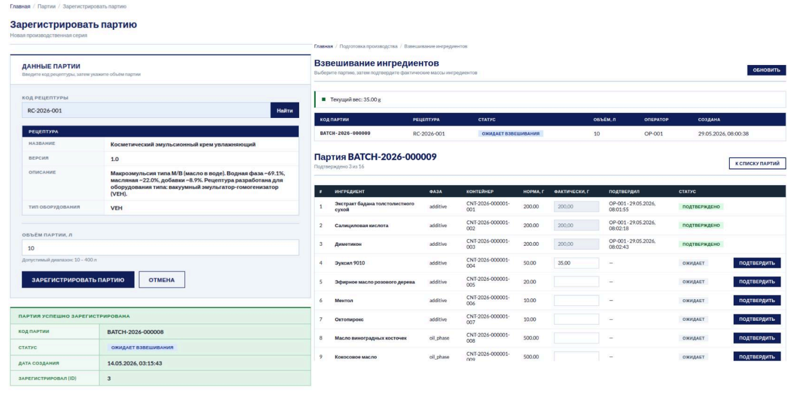

### 7. Процесс эмульгирования
Начало процесса:
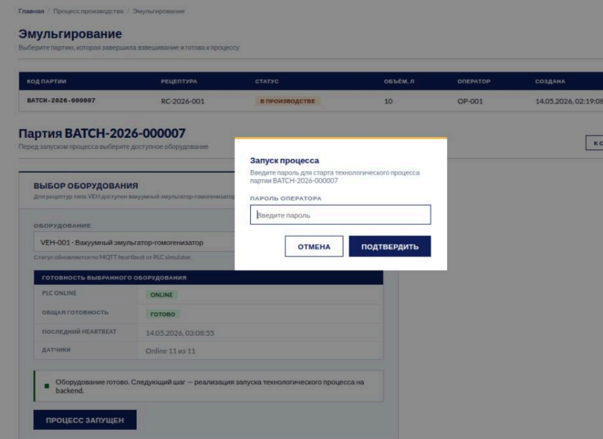
Требование GMP об идентификации оборудования в любое время (п. 7.2.4.2):
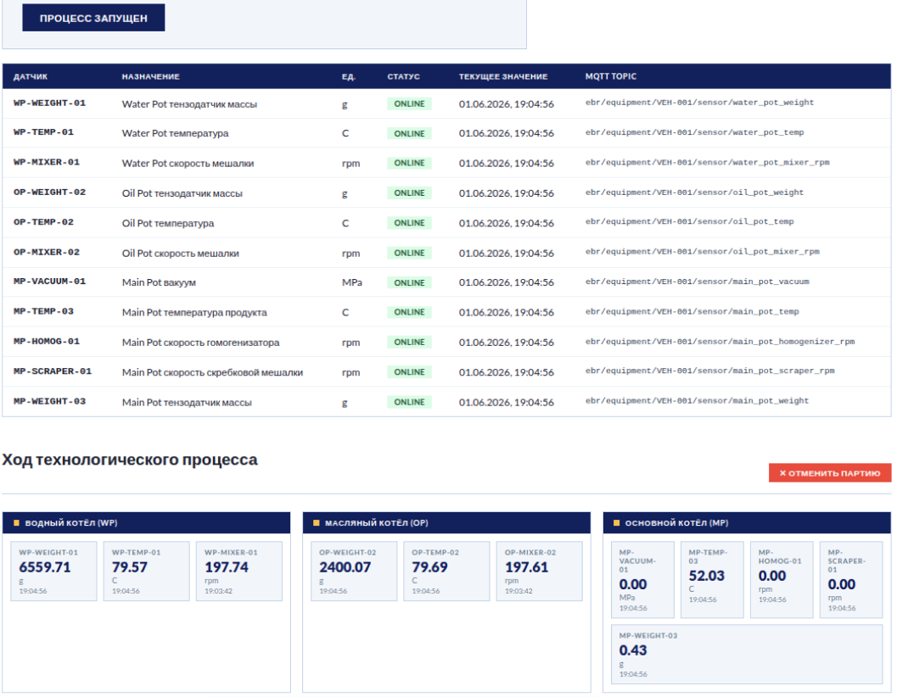
Требование GMP о выполнении операций в соответствии с документацией (п. 7.2.1) + контроль workflow или последовательности стадий процесса и целевых параметров:
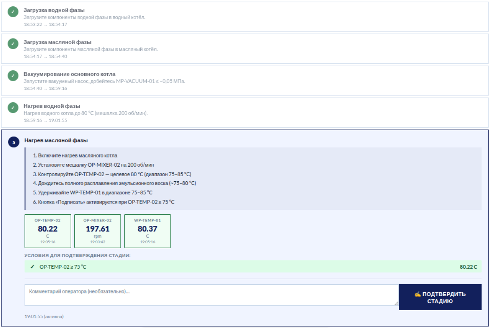

### 8. Сгенерированный отчет
Шапка отчета
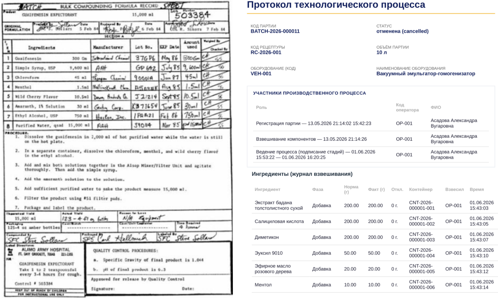
Прослеживаемая фиксация работы датчиков во время каждой стадии процесса
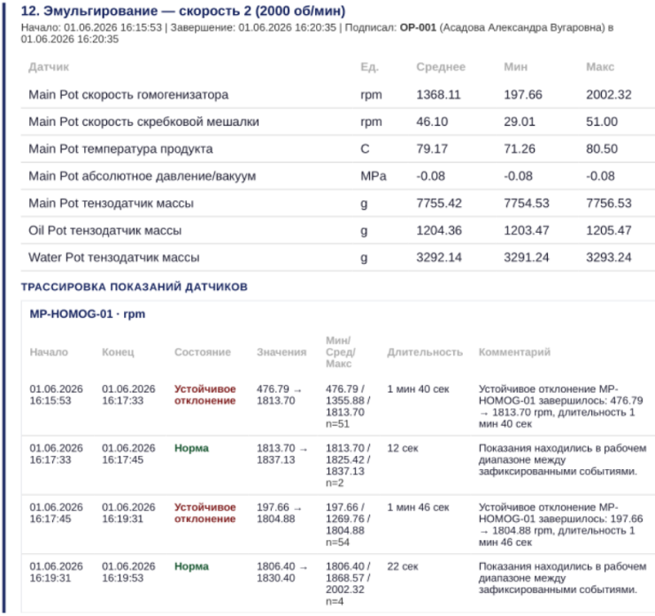
Требование GMP о фиксации любого результата несоответствующего установленным критериям (п. 7.2.5.3):

Три уровня информирования: info, warning, critical
Устойчивые отклонения + шум датчика
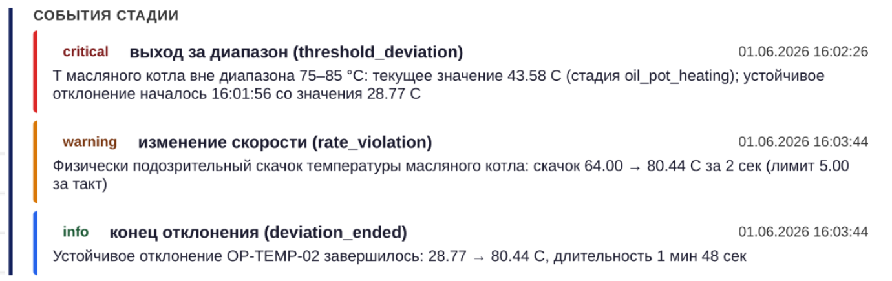
Конец отчета: комментарий оператора с описанием причины досрочного завершения процесса эмульгирования
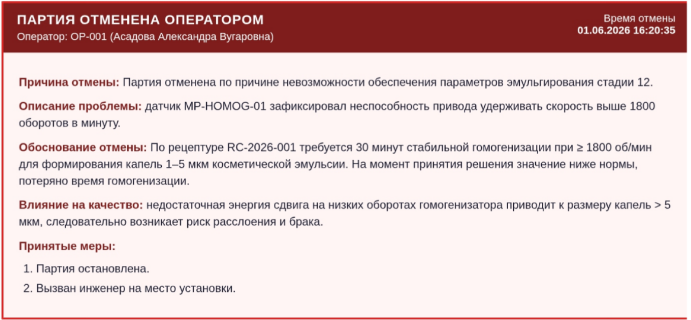


### 9. Аналитика
`GET /api/v1/analytics` — KPI за период, объём по неделям, распределение по статусам и рецептурам, производительность операторов


---

## API

Все защищённые эндпоинты требуют:
```
Authorization: Bearer <JWT>
```

### Аутентификация

#### `POST /api/v1/auth/login`

**Request:**
```json
{ "username": "ivanova_sv", "password": "secret" }
```
**Response `200`:**
```json
{
  "role": "operator", "token": "eyJ...",
  "user_code": "OP-001", "user_name": "ivanova_sv",
  "full_name": "Иванова Светлана Викторовна", "is_active": true
}
```
| Код | Причина |
|-----|---------|
| `401` | Неверный логин или пароль |
| `403` | Аккаунт деактивирован |

---

### Пользователи

#### `POST /api/v1/users` — роль: `admin`

Система автоматически генерирует `user_code` и `user_name` (транслитерация ФИО).

**Request:**
```json
{ "role": "operator", "surname": "Иванова", "name": "Светлана", "father_name": "Викторовна" }
```
**Response `201`:**
```json
{ "user_code": "OP-004", "user_name": "ivanova_sv" }
```

---

### Рецептуры

#### `GET /api/v1/recipes/{code}` — роли: `admin`, `operator`

Архивированные рецептуры возвращают `404` — статус архива скрыт от клиента.

**Response `200`:**
```json
{
  "name": "Крем увлажняющий Aqua Plus", "version": "3.2",
  "min_volume_l": 50, "max_volume_l": 300,
  "description": "Лёгкий увлажняющий крем для всех типов кожи",
  "required_equipment_type": "Гомогенизатор GH-500"
}
```

---

### Партии

#### `POST /api/v1/batches` — роль: `operator`

`registered_by` — из JWT, не от клиента. Создание в транзакции.

**Request:**
```json
{ "recipe_code": "REC-001", "target_volume_l": 100 }
```
**Response `201`:**
```json
{
  "batch_code": "ПР-2026-016", "batch_status": "ЗАРЕГИСТРИРОВАНА",
  "created_at": "2026-05-06T23:38:23Z", "registered_by": 12
}
```
| Код | Причина |
|-----|---------|
| `400` | Объём вне диапазона `[min_volume_l, max_volume_l]` |
| `404` | Рецептура не найдена или в архиве |
| `401` | Невалидный токен |
| `403` | Роль не `operator` |

#### `GET /api/v1/batches` — роли: `admin`, `operator`
Список партий. Query params: `?status=ЗАРЕГИСТРИРОВАНА&limit=20&offset=0`

#### `POST /api/v1/batches/{id}/weighing` — роль: `operator`
Фиксация взвешивания ингредиентов пофазово. Валидация отклонения от нормы.

#### `POST /api/v1/batches/{id}/steps` — роль: `operator`
Регистрация шага технологического процесса.

#### `PATCH /api/v1/batches/{id}/status` — роль: `operator`, `admin`
Смена статуса партии.

#### `GET /api/v1/batches/{id}/report` — роль: `admin`
Экспорт итогового протокола партии.

---

## База данных

| Миграция | Содержание |
|----------|-----------|
| `000001_init` | `users`: роли `admin`/`operator`, bcrypt-хэш, `is_active` |
| `000002_admin` | Seed первого администратора |
| `000003_usercode_index` | Уникальный индекс по `user_code` |
| `000004_ingredients_recipes` | `recipes`, `ingredients` |
| `000005_batches` | `batches`, статусы, FK на `recipes` и `users` |
| `000006_equipment` | `equipment`, поверки, привязка к партиям |

Аудит реализован через триггерную функцию PostgreSQL — каждое изменение строки автоматически записывается в таблицу аудита с временной меткой и идентификатором пользователя.

---

## TODO

### Бэкенд
- [ ] `GET /api/v1/analytics` — KPI и агрегаты
- [ ] `GET /api/v1/notifications` — уведомления оператора

### Инфраструктура

- [ ] Structured logging Zap во все слои


---

## Runbook

### Требования
- Docker + Docker Compose
- Go 1.25+
- `.env` файл в корне проекта

### `.env`
```env
PROJECT_ROOT=/абсолютный/путь/до/проекта

POSTGRES_DB=ebr
POSTGRES_USER=ebr_user
POSTGRES_PASSWORD=ebr_pass
DATABASE_URL=ebr_pass@localhost4:ebr_pass@localhost5:ebr_pass@localhost6:ebr_pass@localhost7/ebr?sslmode=disable

JWT_SECRET=your-secret-key-min-32-chars
SERVER_ADDR=:8080
```

### Запуск

```bash
# 1. Поднять PostgreSQL и MQTT-брокер
make env-up

# 2. Применить миграции
make migrate-up

# 3. Запустить сервис
go run ./cmd/ebr-app/main.go
go run ./cmd/plc-app/main.go
```

Сервис: `http://localhost:8080` — страница входа.

### Утилиты

```bash
# Откатить последнюю миграцию
docker compose run --rm ebr-postgres-migrate \
  -path=/migrations -database "${DATABASE_URL}" down 1

# Подключиться к БД
docker exec -it ebr-env-postgres psql -U ebr_user -d ebr

# Логи сервиса
go run ./cmd/... 2>&1 | tee service.log
```

---

## Структура проекта

```
ebr-monitoring-service/
├── cmd/      
│   ├── ebr-app/     # main.go — точка входа      
│   └── plc-app/     # main.go — точка входа
│       └── internal
│           ├── plc
│           ├── sensor
│           └── simulations 
├── config/mqtt/            # mosquitto.conf
├── docs/                   # Диаграммы и скриншоты
│   ├── arch-system.png
│   ├── arch-layers.png
│   ├── arch-flow.png
│   └── screenshots/
├── internal/
│   ├── domain/             # Сущности, интерфейсы, ошибки — без внешних зависимостей
│   ├── repository/         # SQL-реализации интерфейсов domain
│   ├── service/            # Бизнес-логика, оркестрация
│   └── transport/
│       ├── http/           # HTTP-хендлеры (один файл — один домен)
│       ├── middleware/     # JWT-валидация + RBAC
│       └── wsserver/       # Сборка роутера, graceful shutdown
├── migrations/             # SQL up/down
├── web/                    # login.html, operator.html, admin.html
├── docker-compose.yaml
└── go.mod
```

---

## Роли

| Роль | Доступ |
|------|--------|
| `admin` | `POST /api/v1/users`, все `GET`-эндпоинты, экспорт отчётов |
| `operator` | `GET /api/v1/recipes/{code}`, `POST /api/v1/batches`, регистрация шагов |
